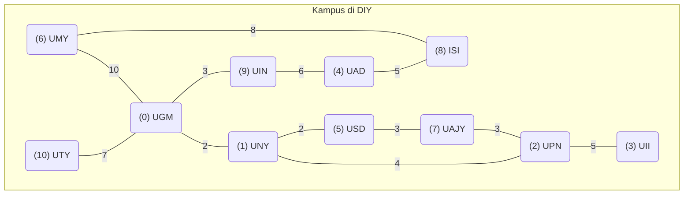

# Diagram JSON Kampus



## JSON File

isi File JSON pada Diagram diatas

```json
}
"nodes": [
    { "id": 0, "name": "UGM" },
    { "id": 1, "name": "UNY" },
    { "id": 2, "name": "UPN" },
    { "id": 3, "name": "UII" },
    { "id": 4, "name": "UAD" },
    { "id": 5, "name": "USD" },
    { "id": 6, "name": "UMY" },
    { "id": 7, "name": "UAJY" },
    { "id": 8, "name": "ISI" },
    { "id": 9, "name": "UIN" },
    { "id": 10, "name": "UTY" }
],
"edges": [
    { "source": 0, "target": 1, "weight": 2 },
    { "source": 1, "target": 2, "weight": 4 },
    { "source": 0, "target": 9, "weight": 3 },
    { "source": 9, "target": 4, "weight": 6 },
    { "source": 1, "target": 5, "weight": 2 },
    { "source": 5, "target": 7, "weight": 3 },
    { "source": 7, "target": 2, "weight": 3 },
    { "source": 6, "target": 0, "weight": 10 },
    { "source": 4, "target": 8, "weight": 5 },
    { "source": 6, "target": 8, "weight": 8 },
    { "source": 2, "target": 3, "weight": 5 },
    { "source": 10, "target": 0, "weight": 7 }
]
}
```
